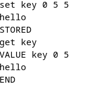
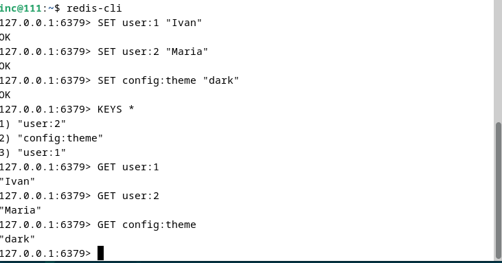

# Домашнее задание к занятию «Кеширование Redis/memcached»"Петровский А.А"

### Задание 1. Кеширование
Примеры проблем, которые решает кеширование:
Снижение нагрузки на базу данных (Database Load):

Проблема: При высоком трафике (например, во время распродажи) база данных может не справиться с количеством запросов на чтение одних и тех же данных (каталог товаров, курсы валют).

Решение: Кеширование помещает часто запрашиваемые данные в оперативную память. Запросы обслуживаются кешем, не доходя до медленного диска БД.

Уменьшение задержки (Latency Reduction):

Проблема: Пользователи жалуются на долгую загрузку страниц. Генерация контента (рендеринг шаблонов, сложные вычисления) занимает время.

Решение: Готовый HTML или результат вычислений сохраняется в кеш. При повторном запросе данные отдаются мгновенно.

Повышение доступности (Availability):

Проблема: Если основной сервис (бэкенд) временно недоступен или работает с ошибками, пользователи видят страницу ошибки.

Решение: При настройке "устаревшего кеша" (stale cache) система может выдать пользователю старые, но рабочие данные из кеша, пока сервис восстанавливается.

Экономия вычислительных ресурсов и денег:

Проблема: Для обработки каждого запроса требуются процессорное время и память, что в облачных инфраструктурах стоит денег.

Решение: Кеш снижает количество необходимых вычислений, позволяя обслуживать тот же трафик на меньшем количестве серверов.

### Задание 2. Memcached

### Задание 3. Удаление по TTL в Memcached

### Задание 4. Запись данных в Redis
